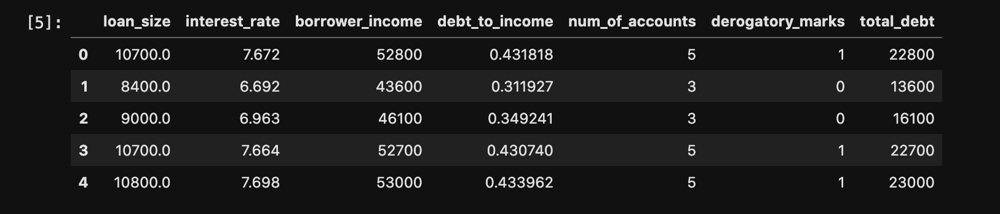
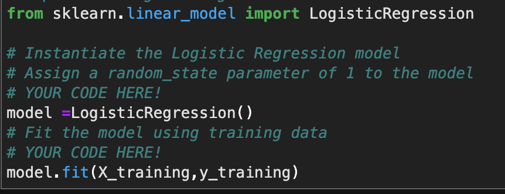
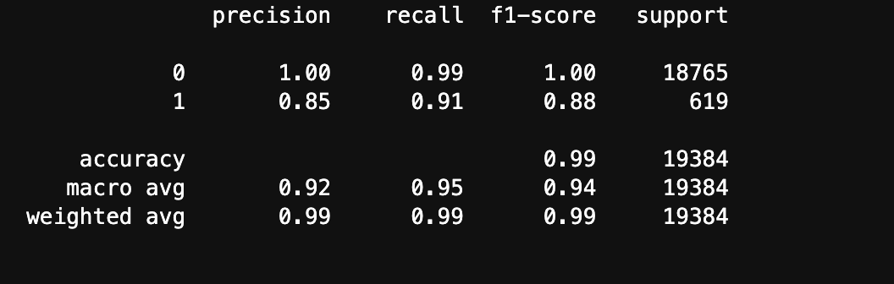

# Week-12-Credit-Analysis-via-Supervized-Machine-Learning

---

Supervized learning is machine learning algorithm which makes estimates and predictions by learning and emulating data that was fed to the system in the form of training data. 

Credit worthiness of an individual can be based on different factors like income, currently outstanding debt amount, previously derogatory remarks, etc. Overall, all these different variables and chances of a person defaulting on their payments.

In this, program we attempt to create a supervized learning where we use different variables to estimate credit worthiness. We also explore confusion matrix and classification metrics to check the efficiency of the model that we made. 

The program also samples different numbers of classes in attempt to remove biases.

---

### Technology and Installation

The program was written on JupyterLab using Python as the programming language. 

Pandas was used to manipulate the dataframe suitable to our use.

The prorgam uses Scikit-learn as machine learning language to evaluate and emulate the training data to make predictions. 

The installation list and commands to install are given below:

---

### Application:

* Pandas used to slice and manipulate data.

* Using Sklearn's Logistic Regression we can predict the targets(predictions) using the variables. 
* Prep the data

* Call upon the model
* Fit the model / make the algorithm to fimiliar to the relationships between the variables.

* Make predictions

* Check accuracy

* Make changes to samples to make better predictions

---

Babin Shrestha